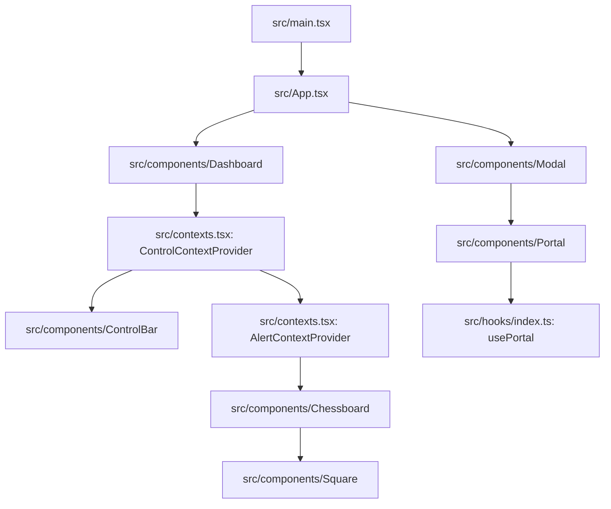
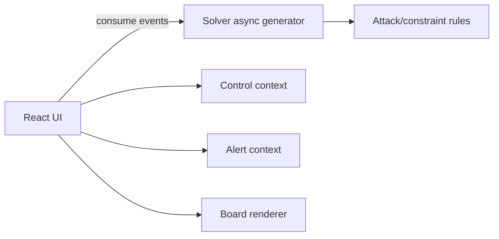

# Eight Queens Problem Visualizer — Project Documentation

> This document is written to be useful for both humans and agentic code assistants: it describes architecture, data flow, key modules, invariants, and clear extension points. It also includes Mermaid diagrams for fast onboarding.

---

## 1) Project overview

This project is an interactive visualizer for the classic **N-Queens** constraint problem, with a twist: you can choose different chess pieces (Queen, Bishop, Rook, Knight), switch between **Manual** mode and **Simulation** mode, adjust **board size**, and control **simulation speed**.

Core behaviors:
- Render an N×N chess board.
- Allow placing/removing a selected piece on squares (manual mode).
- Detect conflicts (attacking moves) for the selected piece type.
- Determine when a placement set is a valid solution (N pieces placed, no conflicts).
- In simulation mode: run a backtracking-style enumerator, animate exploration, and collect solutions.

Tech stack:
- **React 18** + **TypeScript**
- **Vite** (dev/build)
- **styled-components** for styling
- **Vitest** + Testing Library (configured)
- **SVGR** (`*.svg?react`) for importing SVGs as React components
- **uuid** for stable-ish keys in board rendering

---

## 2) Quick start (developer)

From `eight-queens-problem-visualizer/`:

- `npm start` — start dev server (Vite) on port `3000` (strict)
- `npm run build` — build to `dist/`
- `npm run preview` — preview build
- `npm test` — run tests (`vitest run`)
- `npm run tsc` — TypeScript type-check
- `npm run lint` — ESLint
- `npm run format` — Prettier
- `npm run deploy` — build + publish `dist/` via `gh-pages` (requires environment variable noted in `vite.config.ts`)

---

## 3) Repository structure

Top-level highlights:
- `src/` — app code
- `dist/` — build output (generated)
- `index.html` — Vite entry html
- `vite.config.ts` — Vite config (GitHub Pages `base` support)
- `vitest.config.ts` — tests config
- `package.json` — dependencies and scripts

Key `src/` modules:
- `src/main.tsx` — React root mount
- `src/App.tsx` — app shell, modal, page layout
- `src/contexts.tsx` — Control context + Alert context providers
- `src/constants/index.ts` — chess rules + control configs
- `src/utils/index.ts` — delays
- `src/hooks/index.ts` — `useToggle`, `usePortal`, `usePrevious`
- `src/components/` — UI components (board, controls, modal, etc.)
- `src/common/` — shared components like `button.ts`

---

## 4) Runtime architecture

### Component tree & providers

The key providers are composed in `Dashboard`:
- `ControlContextProvider` wraps controls + board
- `AlertContextProvider` wraps the chessboard only (alerts shown there)



### Primary flows (high-level)

There are two main interaction paths:

1) **Manual placement**
- User clicks a square
- `Square` requests placement/removal
- `Chessboard` updates `queenPositions` (more accurately: piece positions)
- The board is re-rendered, conflicts highlighted, and solution state updated

2) **Simulation**
- User starts simulation (Play button)
- `Chessboard` runs an async backtracking enumerator
- Each explored position is animated by setting `queenPositions` then awaiting `delay(speed)`
- Valid solutions are deduped and collected into `solutions`

---

## 5) Domain model & invariants

### Types (`src/types.ts`)
Important TypeScript types:
- `ChessPiece = "queen" | "bishop" | "rook" | "knight"`
- `ControlMode = "manual" | "simulation"`
- `ControlState` and `ControlActions` compose `ControlContextValue`
- Alert types: `AlertState`, `AlertVariant`, `AlertContextValue`
- Board types exist but **the current UI uses a `number[]` positions representation**.

### Positions representation (critical invariant)

Positions are encoded as a **two-digit number**:

- `position = row * 10 + col`
- Rows and cols are **1-based** (range `1..boardSize`).
- Example: row 3 col 5 => `35`

This encoding is manipulated by `checkConflictMethods.getRowAndColumn()` in `src/constants/index.ts`:
- `r = trunc(position / 10)`
- `c = position % 10`

**Caveat / design constraint**: this encoding fails for board sizes >= 10 (collision ambiguity). The UI currently supports 4..8 by config, so it’s safe.

**Invariant expectations**
- In manual mode, user can place up to `boardSize` pieces.
- A “solution” requires:
  - positions array length == `boardSize`
  - no two positions conflict per chosen piece’s movement rules

---

## 6) Chess rule engine (`src/constants/index.ts`)

This file contains:
- Control configs (options + labels)
- Piece icons and types
- Breakpoints (for global styles)
- Conflict detection utilities:
  - `checkConflictMethods`: row/col, diagonal, and piece-specific logic
  - `checkIsAttacking(type, position, existingPositions)`
  - `checkIsSolved(type, positions)`

### Conflict checks
- `queen`: row/column OR diagonal
- `rook`: row/column
- `bishop`: diagonal
- `knight`: L-shape (1 by 2)

```mermaid
flowchart TD
  Position[position: row*10+col] --> RC[getRowAndColumn]
  RC --> Check{piece type?}
  Check -->|queen| QueenRule[sameRowOrColumn OR sameDiagonal]
  Check -->|rook| RookRule[sameRowOrColumn]
  Check -->|bishop| BishopRule[sameDiagonal]
  Check -->|knight| KnightRule[Δr,Δc == (1,2) or (2,1)]
  QueenRule --> Result[conflict?]
  RookRule --> Result
  BishopRule --> Result
  KnightRule --> Result
```

---

## 7) State management

### ControlContext (`src/contexts.tsx`)

Purpose:
- Centralize UI control state: piece type, mode, board size, simulation speed, isSimulating
- Provide update handlers used by `ControlBar` and `Chessboard`

Initialization logic:
- Defaults are derived from the `constants/*ControlBarConfig.options`.
- Some “historical” defaults are chosen by selecting an option at a specific index:
  - simulation speed default takes index 2 from `simulationSpeedControlBarConfig.options` (commonly 50ms)
  - board size default takes index 4 from `boardSizeControlBarConfig.options` (commonly 8)

Exposed actions:
- `handleChessPieceTypeChange(value)`
- `handleModeChange(value)`
- `handleSimulationSpeedChange(value)`
- `handleBoardSizeChange(value)`
- `toggleSimulation()`

### AlertContext (`src/contexts.tsx`)

Purpose:
- Configure and display transient alerts (warning/info/success/error)

Behavior:
- `showAlertMessage({ message, delay, variant })` sets the alert
- A side-effect schedules an auto-reset after `delay` seconds
- Existing timers are cleared on change (debounces successive alerts)

---

## 8) UI components

### `App` (`src/App.tsx`)
- Renders GlobalStyles and layout
- Shows a modal with information text (opened via Info icon)
- Wraps everything with `ErrorBoundary`
- Renders `Dashboard`

### `Dashboard` (`src/components/Dashboard`)
- Composes providers and core UI:
  - `ControlContextProvider`
  - `ControlBar`
  - `AlertContextProvider`
  - `Chessboard`

### `ControlBar` (`src/components/ControlBar`)
- Reads control state from `ControlContext`
- Renders `ControlSelect` controls:
  - Piece type select (always)
  - Mode select (always)
  - Speed select (only in simulation mode)
  - Board size select (always)
- Renders Play/Pause button (only in simulation mode)
- Disables controls while simulating (to avoid invalid concurrent state changes)

### `ControlSelect` (`src/components/ControlSelect`)
- Generic typed select component
- Takes `options: Record<label, value>`
- Handles conversion from `<select>` string values:
  - if `value` prop is number, casts `Number(raw)`
  - else uses string

### `Chessboard` (`src/components/Chessboard`)
The “engine room”: it holds key state and runs simulation.

Local state:
- `queenPositions: number[]` — current placements (piece positions)
- `solutions: number[][]` — solution list (each a positions array)
- `isSolved: boolean`
- `isPreview: boolean` — when user clicks a solution from the list
- `isReset: boolean` — triggers simulation start after reset in effect

Refs (imperative flags):
- `cancelSimulation.current: boolean` — used to stop async simulation loops
- `isInitialRender.current: boolean`
- `isAutomaticallyStopped.current: boolean` — prevents certain stop effects after natural completion

Key behaviors:
- Rebuilds board squares via a memoized `sizeArr` containing `[x, y, uuid]` for each square.
- Disables board pointer events depending on state:
  - disabled if solved, previewing, simulating, or selected mode is simulation

#### Manual placement flow
- `Square.handleClick()` calls back `Chessboard.handleUpdateQueenPosition(isPlaced, position)`
- `Chessboard` adds/removes position and runs `checkIsSolved`
- If solved and correct count, it marks solved and stores solution

#### Solution list
- Solutions are rendered as `li` containing `s.join(",")`.
- Clicking a solution sets `queenPositions` to that arrangement and sets `isPreview`.

### `Square` (`src/components/Square`)
- Computes `isAttacking` using `checkIsAttacking(chessPieceType, position, positions)`
- Highlights squares that would be in conflict with current placements (striped background)
- Enforces max placement count in manual mode:
  - if attempting to place beyond N, triggers an alert

### `Modal` + `Portal` + `usePortal`
- `Modal` renders into a `Portal` with id `"portal"`.
- `Portal` uses `createPortal` to render into a detached node managed by `usePortal`.
- `usePortal` creates a DOM node if it doesn’t exist and cleans up on unmount.
- This avoids z-index / stacking issues and keeps modal outside normal DOM flow.

### `ErrorBoundary`
- Catches render/lifecycle errors and shows fallback

---

## 9) Algorithms

### 9.1 Manual validation
Manual validation is direct:
- On each update, compute if all pairs conflict-free (`checkIsSolved`).
- Complexity: `O(N^2)` pairwise check on N placements.

### 9.2 Simulation enumerator (backtracking)
Simulation uses an async enumeration similar to backtracking, implemented inside `startSimulation`.

Key internal functions:
- `getAllSolutions(rows, columns)`
- `getSolution(rows, columns)`
- It recursively builds valid partial solutions row-by-row.

Important details:
- A candidate placement is constructed as:
  - `position = (rows + 1) * 10 + (column + 1)`
  - That implies the recursion enumerates placements for each row incrementally.
- Before accepting a position, it checks:
  - `!checkIsAttacking(pieceType, position, solution)`
  - Note: it checks against the *partial solution* provided by recursion.
- It animates through all tried columns with `await delay(simulationSpeed)` and updates `queenPositions` frequently.
- When a complete solution is found (`result.length === columns`), it adds it to `solutions` (deduped).

Solution dedupe strategy:
- Uses `new Map([...prevState, result].map((s) => [s.join(), s])).values()`
- This effectively ensures unique solutions by exact position string, not considering symmetry transforms.

Cancellation:
- The async loops check `cancelSimulation.current` frequently.
- If cancellation is requested, it throws `"Simulation Stopped"` which is caught and shown as an alert, followed by `resetAllState()`.

```mermaid
flowchart TD
  Start[User clicks Play] --> Toggle[ControlContext.toggleSimulation => isSimulating=true]
  Toggle --> Reset[Chessboard effect: if isSimulating then resetAllState + isReset=true]
  Reset --> Run[Chessboard effect: if isSimulating && isReset then startSimulation()]
  Run --> Recurse[getAllSolutions/getSolution recursion]
  Recurse --> Try[For each partial solution, try each column in current row]
  Try --> Place[setQueenPositions(...newQueenPositions)]
  Place --> Check{checkIsAttacking?}
  Check -->|attacking| Delay[await delay(speed)]
  Check -->|safe| Add[append to newSolutions; if complete => add to solutions]
  Add --> Delay
  Delay --> Try
  Try --> Done{all explored?}
  Done -->|yes| End[Auto stop: toggleSimulation; setQueenPositions(last solution)]
  Done -->|cancelled| Cancel[throw Simulation Stopped -> alert -> resetAllState]
```

---

## 10) Cross-cutting concerns

### Styling
- `styled-components` everywhere: components co-locate style with markup.
- `src/globalStyles.ts` defines CSS reset + variables + responsive scaling.

### Accessibility
- `ControlSelect` sets `aria-label` and label `htmlFor` as basic support.
- Modal click overlay closes; inner content stops propagation.

### Performance notes
- Board square list uses `uuidv4()` for keys; this is stable only per render of `sizeArr`.
- `sizeArr` is memoized per `boardSize`, so squares keep consistent keys across most interactions. Good enough for React reconciliation, though not ideal for very frequent changes.
- Conflict checks happen per square render. With small N (<=8), this is fine.

---

## 11) Extension guide (how to add features safely)

This section is written specifically to help extend the codebase without breaking invariants.

### 11.1 Add a new chess piece type
Goal: add something like `"king"`.

Steps:
1) Update type unions:
   - `src/types.ts`: `ChessPiece`
   - `src/constants/index.ts`: `ChessPieceTypeValue`

2) Add icon and option:
   - in `CHESS_PIECE_TYPE`, add `{ value: "king", icon: "♔" }`

3) Add movement rule:
   - in `checkConflictMethods`, implement `king` method:
     - conflict if `max(|dr|,|dc|) === 1` (and not same square)
   - extend `checkIsSolved` and `checkIsAttacking` to call it.

4) Ensure `ControlBar` options include it:
   - ControlBar builds chess options by reducing from `chessPieceTypeControlBarConfig.options`. If your config includes `"king"`, it will appear automatically.

5) Simulation correctness:
   - Current simulation assumes one piece per row and enumerates columns per row.
   - That is correct for queen/rook/bishop/knight in the “place N pieces, one per row” framing.
   - If you add a piece where solutions may include multiple per row (not in this project’s framing), you must redesign the solver.

### 11.2 Add symmetry reduction / canonical solutions
Right now, solutions are deduped by exact placement list, not considering rotations/reflections.

Approach:
- Create a canonical transformation function:
  - Convert solution positions to (row,col) pairs
  - Generate 8 transforms (rotations/reflections)
  - Normalize each transform (sort positions)
  - Choose lexicographically smallest string as canonical key
- Use canonical key for dedupe in `setSolutions`.

Recommended location:
- Put transform utilities into `src/utils/` or a new `src/solver/` module.
- Keep `Chessboard` lean by delegating solver logic.

### 11.3 Support board sizes >= 10
Current position encoding breaks for two-digit coordinates.

Recommended change:
- Replace `number` encoding with:
  - either `{ row: number, col: number }` objects
  - or encode as `row * boardSize + col` (0-based) with decode helpers
  - or string `"r,c"` keys

This impacts:
- `Square.position` and how you compute it
- `checkConflictMethods.getRowAndColumn`
- `solutions` display formatting

Migration path:
- Introduce new type `Position` (already exists in `src/types.ts`), then progressively refactor:
  - Change `queenPositions: Position[]`
  - Adjust conflict functions to accept `Position[]`
  - Update UI rendering predicates (`isPlaced` etc.)

### 11.4 Add step-by-step solver visualization (educational mode)
Current simulation paints “current attempt” by setting `queenPositions` each loop.

To add richer visualization:
- Add a `SolverEvent` stream:
  - `"try"` (row, col)
  - `"place"` (row, col)
  - `"backtrack"` (row, col)
  - `"solution"` (placements)
- Drive UI from events rather than just positions.

Implementation suggestion:
- Move solver to `src/solver/backtracking.ts`
- Expose an async generator:
  - `async function* solveNQueens(config): AsyncGenerator<SolverEvent>`
- In `Chessboard`, consume generator and update state per event with `await delay(...)`.

### 11.5 Add persistence (remember settings / solutions)
- Persist `ControlContext` values to `localStorage`.
- On provider init, read and validate stored values against available options.
- Be careful to not persist `isSimulating`.

### 11.6 Add tests
Recommended test targets:
- `checkIsAttacking` for each piece type with known cases
- `checkIsSolved` for known solutions on 4×4 and 8×8 (queen)
- `ControlSelect` numeric conversion
- `AlertContext` timer reset behavior (use fake timers in Vitest)
- Solver correctness: number of solutions for 4×4 queens should be 2 (if enumerating standard N-Queens).

---

## 12) Known limitations & risks

1) **Position encoding** limits board sizes to 9 max safely.
2) **Simulation cancellation** uses flags + throwing errors; it works but is not the cleanest model.
3) Solutions are **not symmetry-reduced**.
4) `Chessboard` contains a lot of logic (UI + solver). Extracting a solver module would improve maintainability.
5) Square keys rely on UUIDs and are stable only per `boardSize` memoization; it’s acceptable but could be simplified to deterministic keys like `${row}-${col}`.

---

## 13) Suggested refactor plan (future-proofing)

If you plan to extend significantly, consider:
- Create a `src/solver/` folder:
  - `solver/types.ts` (Position, Solution, events)
  - `solver/rules.ts` (attacking logic)
  - `solver/backtracking.ts` (pure solver)
- Keep UI components thin:
  - `Chessboard` should orchestrate state and render
  - Solver returns events/solutions; UI just consumes them
- Move solution dedupe/canonicalization into solver or util.



---

## 14) Operational notes (build/deploy)

### GitHub Pages base path
`vite.config.ts` computes Vite `base` from `GITHUB_PAGES_REPO`:
- If set: base becomes `/<repo>/`
- If not set: base is `/` (local dev)

This directly affects asset resolution on GH Pages.

---

## 15) Appendix: Key files and roles

- `src/main.tsx` — mounts React app into `#root`.
- `src/App.tsx` — shell: global styles, info modal, dashboard, footer.
- `src/components/Dashboard/index.tsx` — composes providers + main UI.
- `src/contexts.tsx` — `ControlContext`, `AlertContext`.
- `src/components/ControlBar/index.tsx` — controls UI.
- `src/components/Chessboard/index.tsx` — board UI, manual placement, simulation solver.
- `src/components/Square/index.tsx` — single square rendering + click logic.
- `src/constants/index.ts` — piece types, UI configs, conflict rules.
- `src/utils/index.ts` — `delay` helpers.
- `src/hooks/index.ts` — portal/toggle/previous helpers.
- `src/components/Modal.tsx` + `src/components/Portal.tsx` — modal infra.

---

## 16) Developer “mental model” summary

If you’re an agent or new contributor:
- Think of **ControlContext** as the source of truth for configuration.
- Think of **Chessboard** as both:
  - the board renderer (Squares), and
  - the solver runner (simulation), and
  - the manual validator (solution detection).
- Think of `src/constants/index.ts` as the centralized **rules engine** for conflicts/solving.

When extending:
- Prefer extracting solver logic from `Chessboard` to make features easier to implement and test.
- Avoid changing the position encoding unless you’re ready to update conflict logic and UI checks.

---